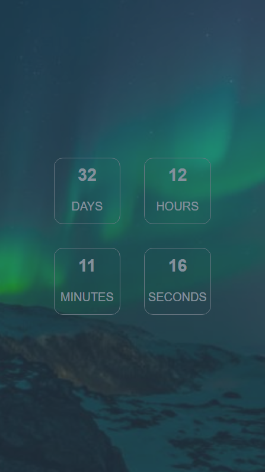
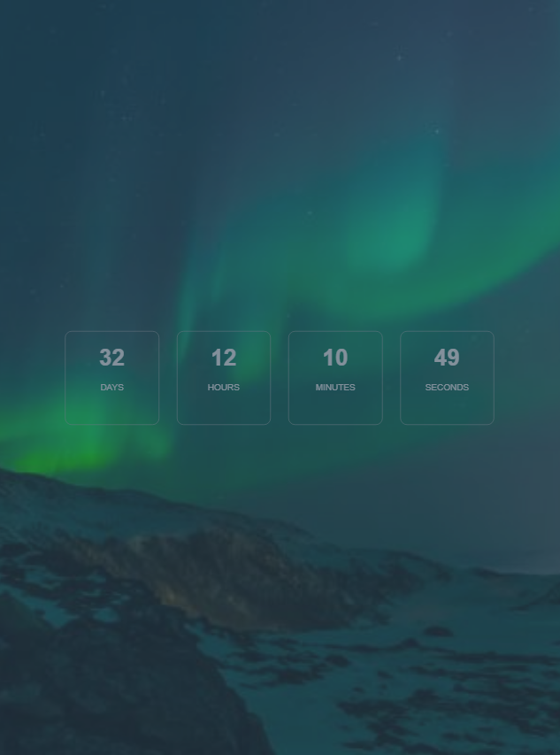
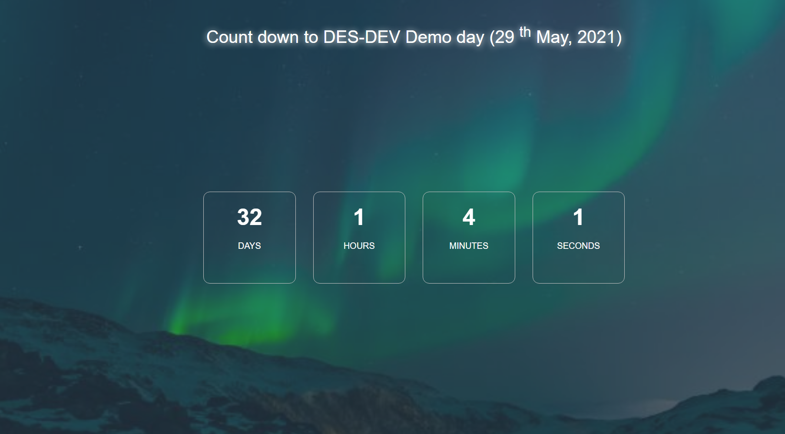

# This repo contains files for task 2 and the actual task.

You are to fork this repo to your Github account, then style the page according to the images provided in the folder `img/screens/` . The script file has already been provided; thus, you do not need to write any JavaScript code for now, you are to only write the CSS file.

**YOU ARE NOT TO EDIT THE HTML FILE; YOU ARE ONLY ALLOWED TO MAKE CHANGES TO THE STYLE.CSS FILE LOCATED IN THE CSS FOLDER (`css/style.css`)**

There are three screenshots provided; which are:

- **Mobile** : `img/screens/mobile.png`
- **Tablet** : `img/screens/tablet.png`
- **Desktop** : `img/screens/desktop.png`

## Your task is to go through them and try as much as you can to replicate the design provided in the images: *(see below)*

